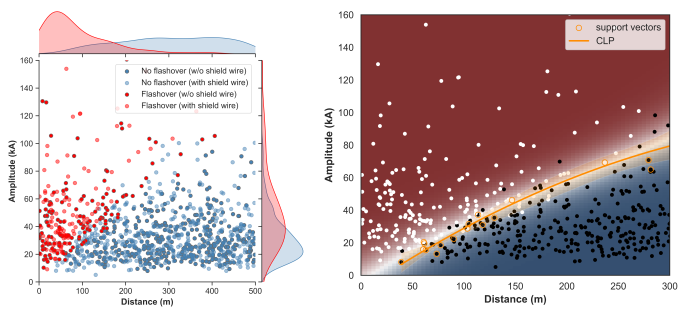

# distlines
### Machine learning analysis of lightning flashovers on electrical power overhead distribution lines.

 

**Monte Carlo** simulation of lightning strike incidence and subsequent flashovers to medium voltage distribution lines, with or without the presence of shield wire(s). Flashover(s) due to four different types of lightning strikes are analyzed: (1) direct strike to phase conductor without shield wire presence, (2) direct strike to phase conductor with shield wire present (i.e. shielding failure), (3) direct strike to shield wire with subsequent flashover (i.e. backflashover event), and (4) indirect (i.e. near-by) lightning strike with and without the presence of shield wire(s), with subsequent flashover on the transmission line insulation (i.e. induced overvoltage). It can be seen that the last point treats two different kinds of overvoltage origins. Generated data set is hierarchical in nature, and class imbalanced.

**Machine learning** application to classification of flashover incidents on distribution lines emanating from lightning strikes. Dataset imbalance is dealt with by using a stratified shuffle split for crating training and test sets, and by class weighting during model training. Support vector machine (SVM) classifier has been implemented as a base estimator for the bagging ensemble (i.e. the bootstrap aggregating ensemble of SVM base models). The bagging ensemble has been crafted using the off-the-shelf model (Variant A), as well as with a hand-made model (Variant B). Main difference between these variants emanates from the treatment of the base estimators. Hyperparameters optimization in each of the variants can be tackled by means of: (a) randomized search, (b) halving random search, and (c) grid search algorithms, in combination with a k-fold cross-validation on the training data set. Pipeline is used for stringing together features processing with bagging ensemble creation and hyperparameters optimization. Models have been developed using the `scikit-learn` library. Jupyter Notebook can be seen rendered [here](https://nbviewer.org/github/sarajcev/distlines/blob/main/models.ipynb).
